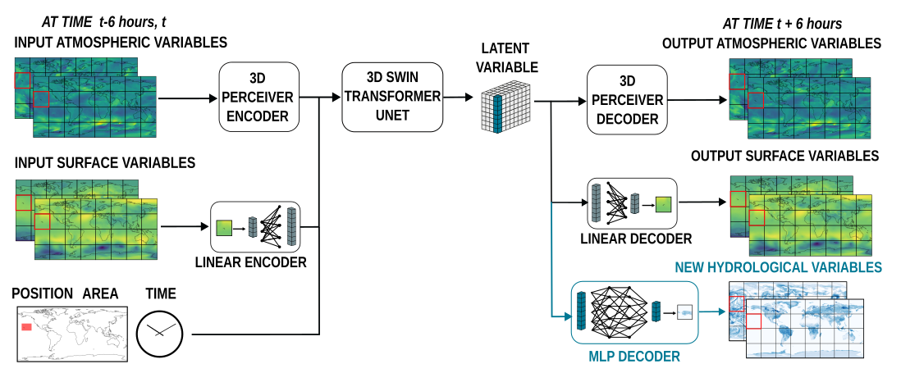

# Finetuning a Weather Foundation Model with Lightweight Decoders for Unseen Physical Processes

This repository supports the [preprint](http://arxiv.org/abs/2506.19088) "Finetuning a Weather Foundation Model with Lightweight Decoders for Unseen Physical Processes" (F. Lehmann, F.Ozdemir, B. Soja, T. Hoefler, S. Mishra, S. Schemm). It provides pretrained decoders for the [Aurora foundation model](https://microsoft.github.io/aurora/intro.html) to predict hydrological variables - precipitation, potential evaporation, runoff, and soil water content - that are absent from the original Aurora model. 



## Code requirements
You need to install the [aurora](https://microsoft.github.io/aurora/usage.html) package. There is no additional requirements for this repository. This repository builds on aurora code from Dec 22, 2024. the new functionalities are added in [aurora_lite.py](aurora/model/aurora_lite.py) and [decoder_lite.py](aurora/model/decoder_lite.py).

The notebook [Inference_decoders.ipynb ](Inference_decoders.ipynb) shows how to make predictions with the pretrained decoders.


## Acknowledgements
This work is completely independent from Microsoft research. It is supported by the Swiss AI Initiative. If you use this work, please cite
```
@online{lehmannFinetuningWeatherFoundation2025,
  title = {Finetuning a {{Weather Foundation Model}} with {{Lightweight Decoders}} for {{Unseen Physical Processes}}},
  author = {Lehmann, Fanny and Ozdemir, Firat and Soja, Benedikt and Hoefler, Torsten and Mishra, Siddhartha and Schemm, Sebastian},
  date = {2025-06-23},
  eprint = {2506.19088},
  eprinttype = {arXiv},
  doi = {10.48550/arXiv.2506.19088},
  url = {http://arxiv.org/abs/2506.19088},
}
```
